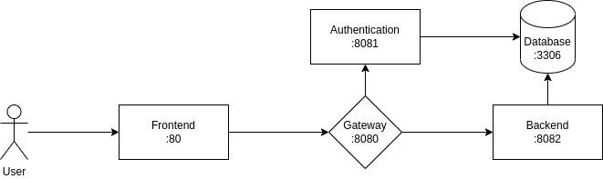

# Aseguradora

**Aseguradora** es un prototipo de un sistema de uso interno para una compañia de seguros. Este prototipo contiene un modulo de vehiculos que permite cotizar la poliza de un vehiculo, guardarla y ver el historial de cotizaciones guardadas.

El proposito de este sistema es demostrar los conocimientos de programacion que adquiri en mis 7 años de experiencia laboral en el periodo 2016-2023.

## Arquitectura del sistema

**Aseguradora** esta desarrollada en una arquitectura de microservicios usando principalmente Spring Boot para los servicios y Angular para el frontend. El sistema esta compuesto por los siguientes servicios o modulos:

* Backend: Servicio en Spring Boot para las operaciones CRUD de cotizaciones.
* Authentication: Servicio en Spring Boot para autenticar credenciales de usuarios.
* Gateway: Servicio en Spring Cloud Gateway para autorizar el acceso a usuarios y redigir al servicio Backend.
* Database: Base de datos en MySQL para almacenar la información de seguros de vehiculos y de usuarios. Los servicios no poseen una base de datos individual para cada uno, sino que usan esta base de datos con datos centralizados.
* Frontend: Proyecto Angular para consumo de servicios y renderización de páginas.

Cada servicio se ejecuta dentro de un contenedor Docker, los cuales son administrados con Docker Compose. En el diagrama, el número que figura debajo del nombre de cada servicio corresponde al puerto asignado en Docker Compose, aunque internamente cada contenedor maneja su propio puerto.

## Compilar y correr proyecto

Para inicializar todos los servicios con sus configuraciones necesarias, compilar y correr los proyectos:

`docker compose up`

Docker Compose se encargará de crear cada contenedor, inicializar la base de datos con un dump, crear un usuario de prueba, y correr cada servicio.

Una vez que cada contenedor este corriendo, se podrá acceder al sistema en la URL: [http://localhost:80](http://localhost:80)

El usuario por defecto tiene las siguientes credenciales:

usuario: test
contraseña: test

Para acceder a la base de datos, el usuario root tiene las siguientes credenciales:

usuario: sistema
contraseña: root
